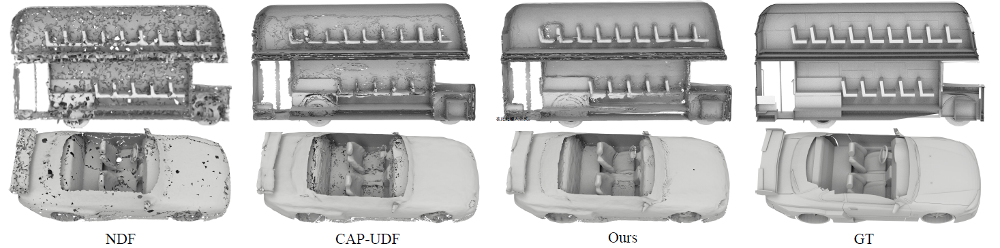
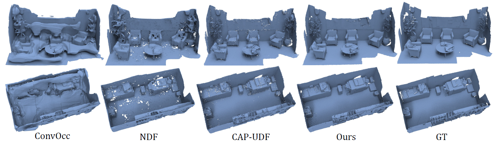
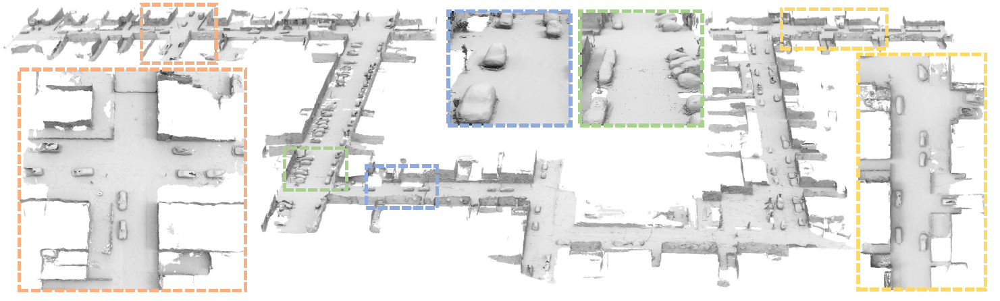

<p align="center">


  <h1 align="center">Enhancing 3D Mesh Completeness in Unsigned Distance Fields Leveraging Proximity-Guided Point Generation</h1>
  <p align="center">
    <a href=""><strong>Hien Toan Lam*</strong></a>
    ·
    <a href=""><strong>Trinh Tran To Bang*</strong></a>
    ·
  </p>
<!--   <p align="center"><strong>(* Equal Contribution)</strong></p>
  <h2 align="center">ICCV 2023</h2>
  <div align="center"></div> -->
</p>

<!-- We release the code of the paper <a href="https://arxiv.org/abs/2308.11441">Learning a More Continuous Zero Level Set in Unsigned Distance Fields through Level Set Projection</a> in this repository. -->


## Reconstruction Results
### SRB
<p align="center">
  
</p>

### Thingi10K
<p align="center">
  
</p>

### FAMOUS
<p align="center">
  
</p>


## Installation
Our code is implemented in Python 3.8, PyTorch 1.9.0 and CUDA 11.1.
- Install python Dependencies
```bash
conda create -n ppg python=3.8
conda activate ppg
conda install pytorch=1.9.0 torchvision=0.10.0 torchaudio=0.9.0 cudatoolkit=11.1 -c pytorch
pip install tqdm pyhocon==0.3.57 trimesh=3.12.7 PyMCubes scipy point_cloud_utils==0.29.7 ninja faiss-gpu open3d
```
- Compile C++ extensions
```
cd extensions/chamfer_dist
python setup.py install
```

## Quick Start

For a quick start, you can train our LevelSetUDF to reconstruct surfaces from a single point cloud as:
```
python run.py --gpu 0 --conf confs/srb.conf --dataname dc --dir dc
```
- We provide the data for a dc in the `./data` folder for a quick start on PPG.

You can find the outputs in the `./outs` folder:

```
│outs/
├──dc/
│  ├── mesh
```
- The reconstructed meshes are saved in the `mesh` folder

## Use Your Own Data
We also provide the instructions for training your own data in the following.

### Data
First, you should put your own data to the `./data/input` folder. The datasets is organised as follows:
```
│data/
│── input
│   ├── (dataname).ply/xyz/npy
```
We support the point cloud data format of `.ply`, `.xyz` and `.npy`

### Run
To train your own data, simply run:
```
python run.py --gpu 0 --conf confs/own_data.conf --dataname (dataname) --dir (dataname)
```

### Notice
- For achieving better performances on point clouds of different complexity, the weights for the losses should be adjusted. For example, we provide three configs in the `./conf` folder, i.e., `srb.conf`, `thingi10k.conf`, and `famous.conf`.

## Related works
Please also check out the following works that inspire us a lot:
* [Junsheng Zhou et al. - Learning consistency-aware unsigned distance functions progressively from raw point clouds. (NeurIPS2022)](https://junshengzhou.github.io/CAP-UDF/)
* [Baorui Ma et al. - Neural-Pull: Learning Signed Distance Functions from Point Clouds by Learning to Pull Space onto Surfaces (ICML2021)](https://github.com/mabaorui/NeuralPull-Pytorch)
* [Baorui Ma et al. - Surface Reconstruction from Point Clouds by Learning Predictive Context Priors (CVPR2022)](https://mabaorui.github.io/PredictableContextPrior_page/)
* [Baorui Ma et al. - Reconstructing Surfaces for Sparse Point Clouds with On-Surface Priors (CVPR2022)](https://mabaorui.github.io/-OnSurfacePrior_project_page/)
* [Baorui Ma et al. - Learning a More Continuous Zero Level Set in Unsigned Distance Fields through Level Set Projection (ICCV2023)](https://github.com/junshengzhou/LevelSetUDF)

## Citation
If you find our code or paper useful, please consider citing
